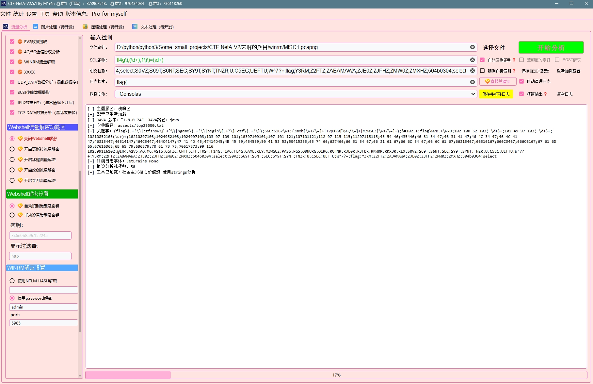
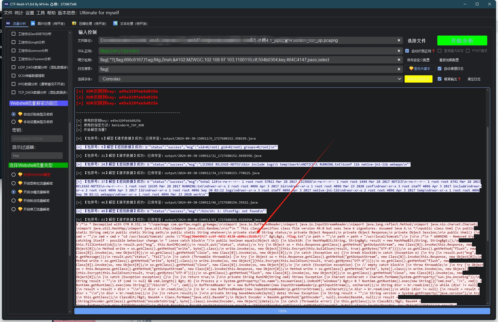
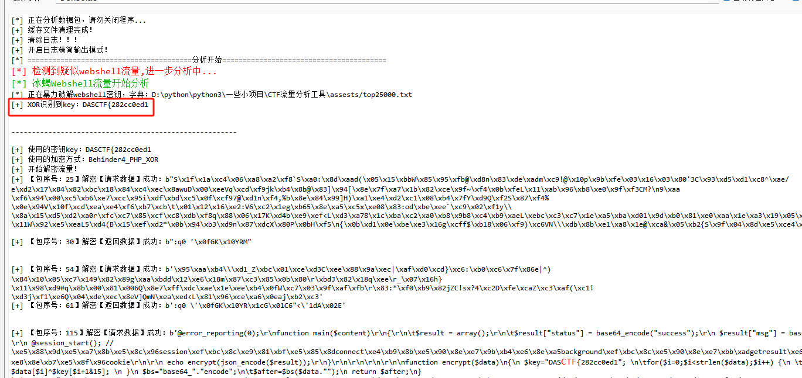
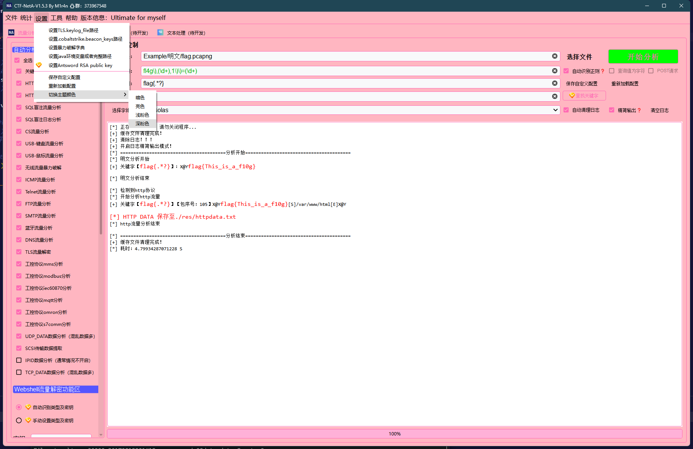

<div align="center">


<h1 align="center">CTF-NetA: CTF网络流量分析工具</h1>

<a href="https://github.com/Arinue/CTF-NetA/releases"></a>
<a href="https://qm.qq.com/q/zof4UXpFD2"></a>
</div>

CTF-NetA是一款专门针对CTF比赛的网络流量分析工具，可以对常见的网络流量进行分析提取flag，软件具有UI，不需要使用者具备任何基础能力。
## 获取软件
免费版请查看<a href="https://github.com/Arinue/CTF-NetA/releases/tag/CTF-NetA-V0.3.0">releases 0.3.0</a>进行下载。
> 
> pro版获取说明：编写和维护该程序花费了本人大量休息时间，获取软件请加🐧群下载：后期将持续更新更多功能。
>
> 点击链接加入群聊【CTF流量分析交流群1】：<a href="https://qm.qq.com/q/uJKoG2ymhW">CTF流量分析交流群1（已满）</a>
>
> 点击链接加入群聊【CTF流量分析交流群2】：<a href="https://qm.qq.com/q/u1MP3ZIVCo">CTF流量分析交流群2</a>
>
> 点击链接加入群聊【CTF流量分析交流群3】：<a href="https://qm.qq.com/q/MGmEIcrjKE">CTF流量分析交流群3</a>
---






## 功能

CTF-NetA具有以下功能：

- 检测明文和常规编码的flag文本
- USB流量还原（包括鼠标和键盘）
- 无线流量暴力破解密码，破解密码后自动分析
- SQL盲注流量分析,支持二分法,支持盲注,自动识别flag
- ICMP流量分析（TTL、DATA.len、DATA、ICMP.code）
- Telnet流量分析
- FTP/FTP-DATA流量分析
- SMTP流量分析(识别登录成功的用户名和密码)
- cs通信流量解密分析（需要提供.cobaltstrike.beacon_keys）
- 蓝牙流量分析
- 工业控制流量支持MMS、modbus、iec60870,mqtt,s7com,OMRON
- TLS流量使用keylog_file自动解密分析
- 一键分离文件（导出的部分文件会存在问题，可进行手动导出）
- 一键导出dicom,ftp-data,http,imf,smb,tftp协议对象
- 一键修复错误流量包
- 统计端口扫描（开放的端口）
- 统计HTTP URI
- DNS流量分析
- 自动保存HTTP传输文件
- webshell流量一键自动识别和解密
- 一键转换etl为pcapng
- UDP协议数据分析
- ...
## 使用

CTF-NetA无需安装，解压即可使用。你可以使用以下命令来运行CTF-NetA：`CTF-NetA.exe`，当然更简单的方法是双击打开~~

程序提供傻瓜式一键操作，大部分功能只需要将流量文件拖入程序点击开始分析即可，TLS和CS通信流量分析需要设置对应的TLS.keylog_file路径和.cobaltstrike.beacon_keys路径！

## 许可

CTF-NetA使用<a href="./LICENSE">MT @ M1r4n</a>进行许可。你可以自由地使用它，只要你遵守许可证的条款和条件。

## 联系

时间紧工作忙，胡乱堆的代码，如果你发现任何问题，或有其他建议，请加QQ群970434034反馈。当然如果该软件对你有所帮助，希望你能点个Star！

## TODO
- sql盲注
  1. 常规盲注【√】
  2. 单字符查询【√】
  3. ascii数字判断查询【√】
  4. 时间盲注
       - 中间件盲注日志【√】
- Webshell流量分析
1. 菜刀蚁剑常规php流量分析【√】
2. 冰蝎3.x流量解密和分析【√】
3. 冰蝎4.x流量解密和分析【√】
4. 哥斯拉流量解密和分析【√】
- 工控流量
1. Modbus 【√】
2. MMS【√】
3. IEC60870【√】
4. MQTT【√】
5. CoAP
6. COTP
7. IEC104
8. IEC61850
9. S7comm【√】
10. OMRON【√】
- 综合分析
  1.  cobaltstrike 流量解密 【√】
  2.  蓝牙流量分析【√】
  3.  USB流量分析【√】
  4.  shiro流量解密和分析
  5.  struts2流量解密和分析
  6.  哥斯拉wenshell识别和解密【*】
  7.  mysql登录和查询语句识别
 哥斯拉4.0 php【√】
 哥斯拉4.0 jsp【√】
 哥斯拉4.0 asp

  8.  冰蝎wenshell识别和解密
     冰蝎4.1 php【√】
     冰蝎4.1 jsp【√】
  10.  蚁剑webshell识别和解密【√】
  11.  菜刀webshell识别和解密【√】
- 协议
  1. DNS 【√】
  2. FTP 【√】
  3. SMTP 【√】
  4. TLS 【√】
  5. TELNET 【√】
  6. MYSQL 【√】
  7. REDIS 【√】
  8. ICMP 【√】
  9. GOOSE 【√】
- other
  1. 更新可选分析协议和内容【√】
  2. 优化UI和运行速度 【√】
  3. 可添加自定义工具【√】
  4. USB鼠标流量优化【√】
  5. 


## 更新记录
```
V2.5.1 20241231
1.修复WINRM流量使用密码解密失败的bug

V2.5.0 20241230
1.添加winrm流量识别和解密（需要手动设置ntlm或者密码）

V2.4.5 20241223
1.修复modbus分析中的一些bug

V2.4.4 20241209
1.从此版本开始，新获取的授权不再受到重装系统影响（以前的授权会受到影响），需要下载完整的最新版再获取授权，不要用旧版本获取授权。

V2.4.3 20241128
1.加强mms协议分析
2.加强modbus异常流量识别

V2.4.2 20241121
1.优化sql盲注中多字符成对出现时匹配错位的bug2

V2.4.1 20241120
1.修复了WIFI流量因文件夹有点导致的解密文件名错误。
2.添加右键解码中文,支持在日志窗口直接解码。

V2.4.0 20241119
1.初步添加了4g5g通信流量分析，识别异常teid。

V2.3.4 20241112
1.修复webshell流量解密中识别不到shell类型的bug

V2.3.3 20241105
1.修复Windows系统的编码GBK引起的协议判断异常

V2.3.2 20241028
1.加强webshell密钥匹配正则

V2.3.1 20241023
1.修复诸多BUG

V2.3.0 20241022
1.添加goose alldata数据识别

V2.2.0 20241021
1.添加颠倒数据索引选项，用于颠倒sql注入数据和索引（少数情况使用）
2.优化sql识别正则

V2.1.1 20241013
1.添加提取ev3蓝牙连接电脑发送的数据【例题在：Example/蓝牙流量/ev3_basic.pklg】

V2.0.1 20241011
1.添加联网更新功能（无需每次下载完整包）
2.放弃打包exe，更改为Pyarmor加密打包

V1.8.6 20240930
1.优化cs流量解密，支持cs3.x流量解密

V1.8.5 20240924
1.修复wifi流量解密时多个ssid导致的问题。

V1.8.4 20240922
1.修复小bug

V1.8.3 20240920
1.改善ftp分析后输出日志显示，增加请求和响应数据区分底色
2.修复TLS流量解密后文件丢失的bug
3.修复冰蝎流量分析中指定密钥无效的bug

V1.8.2 20240905
1.修改单条日志输出长度最大为5000，完整日志在logs/...日志中查看，防止卡死
2.优化IP.ID数据分析
3.修复USBFlow_Soer提示没有tshark环境变量的问题

v1.8.1 20240805
1.添加日志输出窗口右键base64 32 16 decode、url decode和一键发送至CyberChef
2.将webshell中xor识别到的密钥优先级调低至手动设置的密钥之后

v1.8.0 20240802
1.添加mysql流量分析：
    支持识别登录成功的用户名和hash
    支持识别查询语句和返回信息
2.支持自定义设置协议检测线程
3.修复modbus中regval_uint16传输数据解码异常bug
    
v1.7.6 20240731
1.加强和优化USB流量分析
2.添加日志保存按钮
3.webshell解密中，http请求返回包设置不同颜色适配黑色主题

v1.7.5 20240723
1.修复数位板流量分析中的BUG

v1.7.4 20240715
1.重构蓝牙流量分析，增加传输内容和设备识别，以及文件自动保存

v1.7.3 20240711
1.支持日志输出窗口Ctrl+鼠标滚轮改变字体大小
2.dns流量分析小小的优化
3.优化冰蝎流量只有返回包时不能解密的bug

v1.7.2 20240703
1.加强USB流量分析

v1.7.1 20240702
1.增加sql盲注中存在多个列的兼容性（亦可能降低识别精准度）
v1.7.0 20240728
1.支持minidump解密cs流量
2.使用子线程运行URI、open port、ips统计功能
3.优化授权校验机制，增加更多提示信息

v1.6.0 20240727
1.重构日志输出
2.加强webshell请求和响应流量日志分色显示
3.明文关键字作为全局检测高亮
4.修复antSword中识别文件出错的bug

v1.5.4 20240615
1.修复哥斯拉和冰蝎webshell解密中多处bug
2.支持将主题配置保存到配置文件
3.针对icmp协议中部分题目要求seq排序的情况，导出icmp.seq作为序号参照

v1.5.3 20240613
1.丧心病狂，添加了深浅两个粉色主题，目前共四种选择，在【设置】【切换主题颜色】选择

v1.5.2 20240613
1.优化大流量分析机制，大大减少分析时间
2.修复诸多BUG
3.支持识别冰蝎webshell xor加密密钥

v1.5.1
1.增加ip.id数据的识别和处理兼容性
2.修复antsword中部分密文解密失败的问题

v1.5.0 20240605
1.更新部分UI布局
2.支持antsword rsa加密流量解密,需在【设置】中先设置公钥
3.增加了授权错误提示！

v1.4.2 20240604
1.修复暗色和亮色主题切换后出现的显示问题
2.优化文本搜索功能，增强字符高亮显示

v1.4.1 20240603
1.支持webshell解密中class检测和自动反编译
2.优化功能【工具】，将工具输出转到终端作为日志输出
3.支持自定义日志终端字体
4.调整webshell解密功能为单选

v1.3.2 20240601
1.支持哥斯拉和冰蝎的内存马解密
2.支持SCSI协议识别和传输文件导出
v1.3.1 20240530
1.修复http协议识别中bug
2.优化sql盲注中多字符成对出现时匹配错位的bug

v1.3.0 20240527
1.支持调为暗色主题和调整部分功能按钮（有点丑，将就用）

v1.2.12 20240527
1.增加sql盲注兼容性支持，能兼容识别少量特殊正则

v1.2.11 20240523
功能：
    1.添加识别modbus data数据
修复Bug:
    1.修复webshell解密中的bx4_jsp_aes_with_magic类型脏数据去除不干净导致的BUG
    2.修复文件保存中因匹配hex编码导致的异常BUG

v1.2.10 20240520
1.修复机器识别码获取中的BUG

v1.2.9 20240520
1.添加webshell解密成功的流量包序号

v1.2.8 20240517
1.支持一键统计IP会话信息

v1.2.7 20240514
1.优化明文检测规则和展示效果

v1.2.6 20240510
1.添加http协议中传输hex编码后的文件内容检测，并自动保存
2.加入上个版本打包缺失的profile.yaml文件
3.取消启动时自动检测更新

v1.2.5 20240509
1.支持冰蝎3优先检测密钥特征识别，再进行暴力破解
2.修改webshell流量解密中多处BUG，优化处理逻辑

v1.2.4 20240506
1.支持一键统计http所有uri。功能在【统计】【统计 HTTP URI】
2.修复TCP_DATA识别中的BUG
3.修复自动识别保存文件的BUG
4.优化ftp流量分析，加强数据识别能力

v1.2.3 20240424
1.支持右键打开文件快速分析（需要管理员运行"添加右键打开.bat"）
2.重构TLS流量分析，先对流量解密，解密后再重新按照已选功能进行分析
3.优化键盘流量分析器
4.检测tcp数据流中的常规文件并保存

v1.2.2 20240411
1.添加分析进度条
2.设置控制台日志”精简输出“为可选功能
3.修复sql日志分析闪退BUG
4.添加HTTP内容和webshell解密后的内容检测，识别为文件可自动保存到文件夹

v1.2.1 20240409
1.支持ETL类型流量转PCAPNG
2.改关键字匹配时全文输出为精简输出（关键字前30至后80）
3.添加检测到http关键的包序号

v1.2.0 20240408
1.支持输出控制台多个关键字遍历查找并高亮
2.修复多处已知BUG
3.部分UI调整

v1.1.6 20240407
1.支持中间件日志SQL注入查询单个字符识别(例题：Example\SQL盲注日志\字符型注入.log)
2.增加wifi流量分析和破解密码兼容性
3.支持UDP协议DATA数据识别

v1.1.5 20230402
1.修复sql日志分析闪退BUG
2.支持ICMP协议frame.len长度识别
3.添加全局flag关键字高亮

v1.1.4 20240326
1.添加更新检查
2.优化优先检查流量中传输的webshell密钥
3.支持自定义工具和插件
4.修复多处BUG

v1.1.3 20240326
1.调整Behinder4_PHP_WITH_AES解密中增加16位冗余数据处理
2.菜刀蚁剑webshell流量解密功能重构上线

v1.1.2 20240324
1.修复存在自定义关键是错误正则时闪退
2.支持优先检查流量中传输的webshell密钥，再进行暴力破解
3.修复哥斯拉流量解密中因数据异常导致的跳过解密

v1.1.1 20240322
1.添加手动控制程序停止功能（防止卡死和全功能分析时间过长的情况）

v1.1.0 20240321
1.哥斯拉和冰蝎支持自定义密钥解密（自动识别加密类型）
2.支持冰蝎3的php和jsp自动识别和暴力破解密钥解密
3.优化暴力破解字典设置为全局使用和可保存到配置文件下

v1.0.3 20240319
1.webshell解密后高亮关键字"flag"
2.修复ftp协议中分段传输文件自动保存不完整的问题
3.支持冰蝎4.1 php和java各种加密类型的webshell识别及解密，自动暴力破解密钥。
4.修复部分关键高亮异常BUG

v1.0.2 20240311
1.优化telnet流量分析，按照IP整理消息，处理特殊按键输入
2.更换4.2.0版本的tshark
3.支持哥斯拉4webshell php（PHP_XOR_BASE64、PHP_XOR_RAW、PHP_EVAL_XOR_BASE64）和jsp（JAVA_AES_BASE64、JAVA_AES_RAW）识别及解密，自动暴力破解密钥。

v1.0.1 20240308
1.更改UI使用pyqt6编写
2.支持哥斯拉4.0（PHP_EVAL_XOR_BASE64）流量识别和解密

v0.4.4 20240304
1.支持SQL注入中间件日志分析

v0.4.3 20240301
1.修复FTP不同版本流量区别，添加操作命令展示
2.支持FTP-DATA传输文件自动保存
3.更改HTTP文件下载保存到output文件夹下
4.修复诸多BUG
5.优化手动修改sql注入正则输入体验

v0.4.2 20240229
1.修复HTTP文件下载识别中media.type数据同步出错闪退
2.更改关键字识别为可选、功能管理滑动条
3.支持TCP DATA数据检测和识别，例题在"\Example\TCPDATA\zip.pcapng"

v0.4.1 20240228
1.优化启动速度，加快4s左右。
2.修复CS流量分析中数据解析异常闪退BUG
3.修复sql盲注中数据未对齐闪退BUG

v0.4.0 20240226
1.支持ICMP IDBE和IDLE识别，添加识别结果关键字高亮
2.修复多处已知BUG

v0.3.9 20240226
1.修复多处闪退BUG
2.支持http post请求的sql盲注

v0.3.8 20240225
1.支持IPID数据提取
2.添加webshell流量解密信息关键字高亮
3.支持自动保存HTTP传输（包括分段传输）的文件

v0.3.7 20240224
1.优化modbus协议分析，添加word_cnt数据提取
2.优化USB键盘流量分析，处理特殊按键

v0.3.6 20240223
1.使用AI识别SQL盲注语句，SQL盲注识别率大大增加

v0.3.5 20240223
1.支持自定义暴力破解字典
2.添加自动分析功能管理
3.修复多处BUG

v0.3.4 20240223
1.支持识别菜刀蚁剑webshell（php）流量和自动解码
2.修复多处BUG

v0.3.3 20240222
1.支持分析DNS协议

v0.3.2 20240221
1.支持分析工控协议mqtt
2.支持分析工控协议s7comm
3.支持分析工控协议omron

v0.3.1 20240221
1.支持分析工控协议modbus
2.支持分析工控协议iec60870

v0.3.0 20240220
1.支持cs流量解密分析（需要提供.cobaltstrike.beacon_keys）
2.修复MMS流量分析BUG。

v0.2.9 20240130
1.加入其他工具（CyberChef）

v0.2.8 20240123
1.优化蓝牙流量分析
2.优化ICMP协议分析
3.优化SQL盲注判断条件
4.添加日志自动清理选项

v0.2.7 20230119
1.支持一键修复流量包
2.支持SMTP协议登录分析
3.修复多处BUG

v0.2.6 20240118
1.支持TLS流量解密，需设置tls.keylog_file
2.支持工业控制协议MMS分析

v0.2.5 20240116
1.支持sql正则可选自动识别
2.分析蓝牙协议，探测pin码，识别传输文件信息

v0.2.4 20240111
1.优化鼠标流量画图机制
2.部分UI设计调整

v0.2.3 20240110
1.支持扫描端口统计（开放的端口）

v0.2.2 20240109
1.支持一键导出文件功能，支持协议：dicom,ftp-data,http,imf,smb,tftp
2.FTP登录包分析，识别登录成功的用户名和密码
3.优化多处BUG

v0.2.1 20240108
1.支持一键分离（foremost）文件，支持任何文件
2.支持SQL注入正则自动识别

v0.2.0 20240107
1.修改ui为自适应分辨率和自适应窗口大小
2.更新UI
3.支持telnet流量分析

v0.1.35
1.支持ICMP流量分析

v0.1.34 
1.支持配置保存和导入按钮

v0.1.33
1.修复部分bug。
2.修复wifi流量破解密码后重新分析数据异常。
```

## 感谢

感谢以下项目：

> https://github.com/gchq/CyberChef
> 
> https://github.com/5ime/CS_Decrypt
>
> https://gitee.com/fengerxi/large-set-of-ctf-flow-problems
>
> https://github.com/y1shiny1shin/USBFlow_Soer
